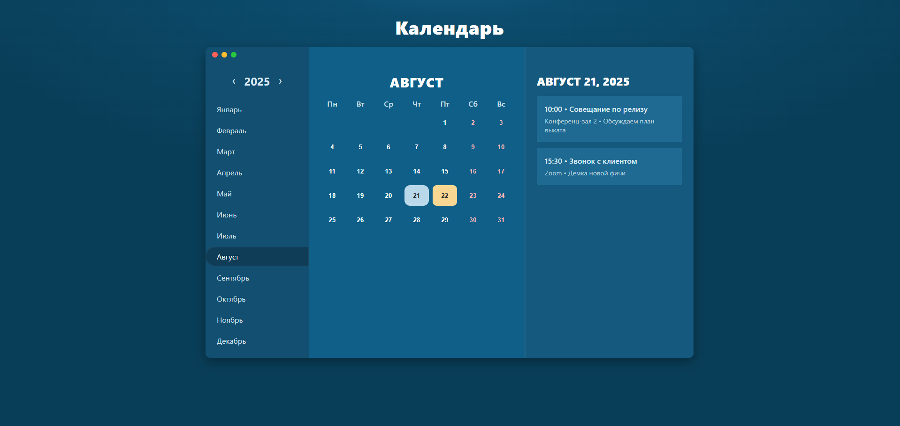

# Schedule Calendar

Интерактивный календарь в классическом стиле с поддержкой расписания и событий.



## 📌 Возможности
- Всегда открывается **текущий месяц текущего года**.
- Подсвечивается **сегодняшний день** (`.day.today`).
- Подсветка **текущего месяца этого года** в списке месяцев (легкая подсветка, отличающаяся от выбранного).
- Поддержка отображения **событий** (через объект `events` в `app.js`).
- Адаптивный дизайн: корректно работает на разных размерах экрана.

## 🗂️ Структура проекта
- `index.html` — основная страница приложения.
- `css/styles.css` — стили интерфейса (добавлен стиль `.current-year-month`).
- `js/app.js` — логика календаря (модифицирована функция `renderMonths()` для подсветки текущего месяца).
- `PATCH_NOTES.md` — описание внесённых изменений.

## 🎨 Стили подсветки
- `.day.today` — выделение текущей даты.
- `.day.picked` — выбранный пользователем день.
- `.months li.active` — выбранный месяц.
- `.months li.current-year-month` — текущий месяц *текущего года* (подсветка более светлым цветом).

## 🚀 Использование
1. Откройте `index.html` в браузере.
2. Календарь автоматически загрузит текущий месяц и год.
3. Клик по дню — выбор даты, события отображаются справа.
4. Навигация по годам с помощью кнопок `‹` и `›`.

## 🛠️ Настройка событий
События задаются в файле `js/app.js` в объекте `events`:
```js
const events = {
  "2025-08-21": [
    { time: "10:00", title: "Совещание", location: "Конференц-зал", desc: "Планирование релиза" }
  ]
};
